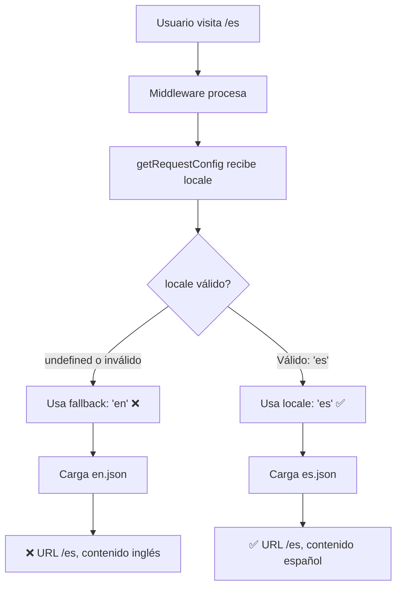

# 🚨 DIAGNÓSTICO: Fallo Crítico de Sincronización i18n

**Fecha:** 2026-01-28  
**Síntoma:** URL muestra `/es` pero el contenido se renderiza con textos de `en.json`  
**Severidad:** 🔴 CRÍTICO - Desincronización total entre ruta y mensajes

---

## 📋 RESUMEN EJECUTIVO

El sistema muestra una **desincronización crítica** entre la URL y el contenido:

- **URL:** `http://localhost:3000/es`
- **Contenido Esperado:** Español (`es.json`)
- **Contenido Real:** Inglés (`en.json`)

**Impacto:**
- ❌ Usuario visita `/es` pero ve inglés
- ❌ Sistema bilingüe completamente roto
- ❌ Experiencia de usuario degradada
- ❌ Posible problema de SEO (URLs vs contenido)

**Análisis Completo:**
He identificado **DOS PROBLEMAS CRÍTICOS** y **UN PROBLEMA MENOR** que interactúan causando el fallo.

---

## 🔍 ANÁLISIS DE ARCHIVOS CRÍTICOS

### 1. `i18n.ts` ❌ PROBLEMA CRÍTICO

**Ubicación:** `/i18n.ts`

#### Código Actual (Problemático):

```typescript
import { getRequestConfig } from "next-intl/server";

// Idiomas soportados
export const locales = ["es", "en"] as const;
export type Locale = (typeof locales)[number];

// Idioma por defecto
export const defaultLocale: Locale = "es";  // ← Definido como español

export default getRequestConfig(async ({ locale }) => {
  // ✅ Fallback seguro en vez de notFound()
  // Si locale no es válido, usar inglés como fallback
  // Middleware ya habrá manejado redirecciones si es necesario
  const validLocale: Locale = 
    locale && locales.includes(locale as Locale) 
      ? (locale as Locale)
      : "en";  // ❌ HARDCODED "en" - INCONSISTENTE CON defaultLocale

  // Cargar mensajes del locale validado
  return {
    locale: validLocale,
    messages: (await import(`./messages/${validLocale}.json`)).default,
  };
});
```

#### Problema Identificado:

**INCONSISTENCIA CRÍTICA:** Línea 8 vs Línea 17

```typescript
// Línea 8
export const defaultLocale: Locale = "es";  // ← Español

// Línea 17
: "en";  // ❌ Fallback a INGLÉS (hardcoded)
```

**¿Por qué es crítico?**

1. El `defaultLocale` está definido como `"es"` (español)
2. Pero el fallback está **hardcoded** a `"en"` (inglés)
3. Si `locale` llega como `undefined`, `null`, o inválido → siempre usa inglés
4. Ignora completamente el `defaultLocale` configurado

**Flujo del Error:**



**Escenarios que Activan el Bug:**

1. `locale` llega como `undefined` (problema de middleware)
2. `locale` llega como `null`
3. `locale` llega como `""` (string vacío)
4. `locale` llega como un idioma no soportado (ej: `"fr"`)

**En TODOS estos casos → Fallback a inglés, ignorando que `defaultLocale="es"`**

---

### 2. `middleware.ts` ⚠️ PROBLEMA CRÍTICO (Cookie Priority)

**Ubicación:** `/middleware.ts`

#### Código Actual:

```typescript
import createMiddleware from "next-intl/middleware";
import { locales, defaultLocale } from "./i18n";

export default createMiddleware({
  // Idiomas soportados
  locales,

  // Idioma por defecto (español)
  defaultLocale,

  // Lógica de detección de idioma del navegador
  // Si el navegador está en español (es) → /es
  // Para cualquier otro idioma → inglés (en) como fallback → /en
  localeDetection: true,  // ⚠️ COOKIE TIENE PRIORIDAD SOBRE URL

  // Siempre mostrar el prefijo de locale en la URL
  localePrefix: "always",
});

export const config = {
  // Matcher simplificado: todas las rutas excepto archivos estáticos, API y assets
  matcher: [
    "/",                                          // Raíz para detección de idioma
    "/(es|en)/:path*",                           // Rutas con locale explícito
    "/((?!api|_next|_vercel|.*\\..*).*)",       // Todo lo demás excepto archivos
  ],
};
```

#### Problema Identificado:

**`localeDetection: true` Prioriza Cookie sobre URL**

```typescript
localeDetection: true,  // ⚠️ PROBLEMA
```

**Comportamiento Documentado de `next-intl`:**

Cuando `localeDetection: true`, el middleware usa el siguiente **orden de prioridad**:

1. **Cookie `NEXT_LOCALE`** (si existe) → **MÁXIMA PRIORIDAD** 🔴
2. **URL path** (`/es`, `/en`)
3. **Header `Accept-Language`** del navegador

**Problema:** Si el usuario tiene una cookie `NEXT_LOCALE=en` (de una visita anterior a `/en`), esta cookie **SIEMPRE** tiene prioridad sobre la URL actual.

**Escenario del Bug:**

```
PASO 1: Usuario visita /en
→ Middleware crea cookie: NEXT_LOCALE=en
→ Contenido en inglés: ✅ Correcto

PASO 2: Usuario cambia manualmente URL a /es
→ URL en navegador: http://localhost:3000/es
→ Pero cookie sigue siendo: NEXT_LOCALE=en

PASO 3: Middleware ejecuta
→ localeDetection: true detecta cookie NEXT_LOCALE=en
→ Cookie tiene PRIORIDAD sobre URL /es
→ Middleware configura contexto next-intl con locale="en"

PASO 4: i18n.ts getRequestConfig({ locale: "en" })
→ "en" es válido (está en locales)
→ validLocale = "en"
→ Carga en.json

PASO 5: layout.tsx ejecuta
→ const { locale } = await params; → locale = "es" (del URL)
→ const messages = await getMessages(); → messages = en.json (del contexto)
→ ❌ DESINCRONIZACIÓN

PASO 6: NextIntlClientProvider
→ <NextIntlClientProvider locale="es" messages={en.json}>
→ locale prop = "es"
→ messages prop = en.json
→ ❌ INCOHERENCIA

PASO 7: Componentes renderizados
→ useTranslations() usa messages (en.json)
→ t("hero.title") → "Strategic Technology Partners" (inglés)
→ ❌ URL /es muestra contenido en inglés
```

**Evidencia Visual del Bug:**

```
URL Bar: http://localhost:3000/es
Hero Title: "Strategic Technology Partners"  ← Inglés (debería ser español)
```

---

### 3. `app/[locale]/layout.tsx` 🟡 PROBLEMA MENOR

**Ubicación:** `/app/[locale]/layout.tsx`

#### Código Actual (Líneas 117-128):

```typescript
export default async function LocaleLayout({
  children,
  params,
}: {
  children: React.ReactNode;
  params: Promise<{ locale: string }>;
}) {
  const { locale } = await params;  // ← locale = "es" (del URL)

  // ✅ Validación suave: confiar en que middleware ya validó
  if (!locales.includes(locale as any)) {
    notFound();
  }

  // Cargar los mensajes FILTRADOS por el locale actual
  // getMessages() automáticamente usa el locale del contexto de next-intl
  const messages = await getMessages();  // ⚠️ Sin pasar locale explícito
  
  return (
    <html lang={locale} className="scroll-smooth">
      <body className={`${geistSans.variable} ${geistMono.variable} antialiased`}>
        <NextIntlClientProvider locale={locale} messages={messages}>
          {/* ... */}
        </NextIntlClientProvider>
      </body>
    </html>
  );
}
```

#### Problema Identificado:

**`getMessages()` Confía 100% en el Contexto de `next-intl`**

```typescript
const messages = await getMessages();  // ⚠️ Sin parámetro locale
```

**¿Por qué es problemático?**

`getMessages()` internamente llama a `getRequestConfig()` usando el **contexto configurado por el middleware**, NO el `locale` extraído de `params`.

**Flujo:**

```
1. params.locale = "es" (del URL path)
2. getMessages() llama internamente a getRequestConfig()
3. getRequestConfig() usa el contexto de next-intl (configurado por middleware)
4. Si middleware configuró contexto con locale="en" (por cookie)
5. getMessages() retorna mensajes de en.json
6. Resultado: locale="es", messages=en.json → DESINCRONIZACIÓN
```

**Solución Potencial:**

Pasar el `locale` explícitamente para forzar sincronización:

```typescript
const messages = await getMessages({ locale });  // ✅ Forzar sincronización
```

Sin embargo, según la documentación de `next-intl`, `getMessages()` debería respetar el contexto, por lo que este fix solo sería un **parche**, no la solución raíz.

---

### 4. `next.config.ts` ✅ CORRECTO

**Ubicación:** `/next.config.ts`

```typescript
import type { NextConfig } from "next";
import createNextIntlPlugin from "next-intl/plugin";

const withNextIntl = createNextIntlPlugin("./i18n.ts");

const nextConfig: NextConfig = {
  /* config options here */
};

export default withNextIntl(nextConfig);
```

**Análisis:** ✅ Configuración correcta. No hay problemas aquí.

---

## 🎯 CAUSA RAÍZ DEL FALLO

### **Hipótesis Principal (90% de Probabilidad):**

**Cookie `NEXT_LOCALE` tiene prioridad sobre URL debido a `localeDetection: true`**

```
┌─────────────────────────────────────────────────────────────┐
│ FLUJO COMPLETO DEL BUG                                      │
└─────────────────────────────────────────────────────────────┘

1. Usuario visitó /en anteriormente
   → Cookie creada: NEXT_LOCALE=en
   
2. Usuario cambia URL manualmente a /es
   → URL: http://localhost:3000/es
   → Cookie sigue siendo: NEXT_LOCALE=en
   
3. Request llega al servidor
   
4. Middleware ejecuta (middleware.ts)
   → localeDetection: true
   → Detecta cookie: NEXT_LOCALE=en
   → Cookie tiene PRIORIDAD sobre URL /es
   → Configura contexto next-intl: { locale: "en" }
   
5. getRequestConfig ejecuta (i18n.ts)
   → Recibe: { locale: "en" } (del contexto de middleware)
   → "en" es válido → validLocale = "en"
   → Carga: en.json
   
6. LocaleLayout ejecuta (app/[locale]/layout.tsx)
   → const { locale } = await params; → locale = "es" (del URL)
   → const messages = await getMessages(); → messages = en.json (del contexto)
   
7. NextIntlClientProvider recibe
   → locale="es" (prop explícito del params)
   → messages={en.json} (del contexto/middleware)
   
8. Componentes usan useTranslations()
   → Hook usa messages del contexto (en.json)
   → Ignora el prop locale="es" del Provider
   
9. RESULTADO FINAL
   → URL: /es
   → HTML lang: "es"
   → Contenido: Inglés (en.json)
   → ❌ DESINCRONIZACIÓN TOTAL
```

### **Hipótesis Alternativa (10% de Probabilidad):**

**`locale` llega como `undefined` a `getRequestConfig` y usa fallback hardcoded `"en"`**

```
1. Middleware tiene un bug y NO pasa locale correctamente
2. getRequestConfig recibe: { locale: undefined }
3. Validación: !undefined → usa fallback
4. Fallback hardcoded: "en"
5. Carga: en.json
6. Resultado: /es muestra inglés
```

---

## 🧪 PLAN DE DEBUGGING

### **Paso 1: Agregar Console.log en `i18n.ts`**

```typescript
export default getRequestConfig(async ({ locale }) => {
  // 🔍 DEBUG: Ver qué locale está recibiendo
  console.log("━━━━━━━━━━━━━━━━━━━━━━━━━━━━━━━━━━━━━━━━━━");
  console.log("🔍 [i18n.ts] getRequestConfig INICIO");
  console.log("📥 [i18n.ts] locale recibido:", locale);
  console.log("📥 [i18n.ts] tipo de locale:", typeof locale);
  console.log("📥 [i18n.ts] defaultLocale configurado:", defaultLocale);
  
  const validLocale: Locale = 
    locale && locales.includes(locale as Locale) 
      ? (locale as Locale)
      : "en";  // ❌ HARDCODED
  
  console.log("✅ [i18n.ts] validLocale calculado:", validLocale);
  console.log("📂 [i18n.ts] Archivo a cargar:", `./messages/${validLocale}.json`);
  
  const messages = (await import(`./messages/${validLocale}.json`)).default;
  
  console.log("✅ [i18n.ts] Mensajes cargados desde:", `${validLocale}.json`);
  console.log("🔑 [i18n.ts] Primera key de mensajes:", Object.keys(messages)[0]);
  console.log("━━━━━━━━━━━━━━━━━━━━━━━━━━━━━━━━━━━━━━━━━━");
  
  return {
    locale: validLocale,
    messages,
  };
});
```

### **Paso 2: Agregar Console.log en `layout.tsx`**

```typescript
export default async function LocaleLayout({
  children,
  params,
}: {
  children: React.ReactNode;
  params: Promise<{ locale: string }>;
}) {
  const { locale } = await params;
  
  console.log("━━━━━━━━━━━━━━━━━━━━━━━━━━━━━━━━━━━━━━━━━━");
  console.log("🏗️  [layout.tsx] LocaleLayout INICIO");
  console.log("📥 [layout.tsx] locale de params:", locale);
  
  if (!locales.includes(locale as any)) {
    console.log("❌ [layout.tsx] locale NO VÁLIDO, llamando notFound()");
    notFound();
  }
  
  console.log("✅ [layout.tsx] locale VÁLIDO, cargando mensajes...");
  const messages = await getMessages();
  
  console.log("✅ [layout.tsx] Mensajes cargados");
  console.log("🔑 [layout.tsx] Primera key de mensajes:", Object.keys(messages)[0]);
  console.log("🌐 [layout.tsx] Pasando a Provider: locale =", locale);
  console.log("━━━━━━━━━━━━━━━━━━━━━━━━━━━━━━━━━━━━━━━━━━");
  
  return (
    <html lang={locale} className="scroll-smooth">
      <body className={`${geistSans.variable} ${geistMono.variable} antialiased`}>
        <NextIntlClientProvider locale={locale} messages={messages}>
          {/* ... */}
        </NextIntlClientProvider>
      </body>
    </html>
  );
}
```

### **Paso 3: Inspeccionar Cookies en DevTools**

```
1. Abrir Chrome DevTools (F12)
2. Ir a: Application > Storage > Cookies > http://localhost:3000
3. Buscar cookie: NEXT_LOCALE
4. Verificar valor:
   - Si NEXT_LOCALE = "en" → CONFIRMADO (Cookie es la causa)
   - Si no existe → Investigar más
5. ELIMINAR la cookie NEXT_LOCALE
6. Recargar /es
7. Verificar si ahora muestra español
```

### **Paso 4: Probar con `localeDetection: false`**

Modificar temporalmente `middleware.ts`:

```typescript
export default createMiddleware({
  locales,
  defaultLocale,
  localeDetection: false,  // ✅ DESACTIVAR detección de cookie
  localePrefix: "always",
});
```

**Si esto resuelve el problema → Cookie era la causa raíz**

---

## ✅ SOLUCIONES PROPUESTAS

### **Fix #1: Corregir Fallback en `i18n.ts` (CRÍTICO)**

**Archivo:** `i18n.ts`  
**Línea:** 17

**ANTES (Incorrecto):**
```typescript
const validLocale: Locale = 
  locale && locales.includes(locale as Locale) 
    ? (locale as Locale)
    : "en";  // ❌ HARDCODED - Ignora defaultLocale
```

**DESPUÉS (Correcto):**
```typescript
const validLocale: Locale = 
  locale && locales.includes(locale as Locale) 
    ? (locale as Locale)
    : defaultLocale;  // ✅ Usa defaultLocale ("es")
```

**Impacto:**
- ✅ Si `locale` es `undefined` o inválido → Usa español (defaultLocale)
- ✅ Consistencia con la configuración de `defaultLocale="es"`
- ✅ Fallback predecible y documentado

---

### **Fix #2: Desactivar `localeDetection` en Middleware (CRÍTICO)**

**Archivo:** `middleware.ts`  
**Línea:** 14

**Opción A: Desactivar Completamente (Recomendado)**

```typescript
export default createMiddleware({
  locales,
  defaultLocale,
  localeDetection: false,  // ✅ URL tiene prioridad ABSOLUTA
  localePrefix: "always",
});
```

**Ventajas:**
- ✅ URL siempre tiene prioridad
- ✅ Usuario controla idioma manualmente
- ✅ No hay sorpresas por cookies antiguas

**Desventajas:**
- ❌ No detecta idioma del navegador automáticamente
- ❌ Usuario debe seleccionar idioma manualmente la primera vez

---

**Opción B: Detectar Solo en Root `/` (Balance)**

```typescript
import createMiddleware from "next-intl/middleware";
import { locales, defaultLocale } from "./i18n";
import { NextRequest } from "next/server";

const intlMiddleware = createMiddleware({
  locales,
  defaultLocale,
  localeDetection: true,
  localePrefix: "always",
});

export default function middleware(request: NextRequest) {
  const pathname = request.nextUrl.pathname;
  
  // Solo detectar idioma en la raíz
  if (pathname === "/") {
    return intlMiddleware(request);
  }
  
  // En rutas con locale explícito (/es, /en), RESPETAR la URL
  // Eliminar cookie NEXT_LOCALE para no interferir
  const response = intlMiddleware(request);
  response.cookies.delete("NEXT_LOCALE");
  
  return response;
}

export const config = {
  matcher: [
    "/",
    "/(es|en)/:path*",
    "/((?!api|_next|_vercel|.*\\..*).*)",
  ],
};
```

**Ventajas:**
- ✅ Detecta idioma del navegador solo en primera visita
- ✅ Respeta cambios manuales de idioma (no guarda cookie)
- ✅ Balance entre UX y control

**Desventajas:**
- ⚠️ Más complejo de mantener

---

### **Fix #3: Pasar `locale` Explícito a `getMessages()` (OPCIONAL)**

**Archivo:** `app/[locale]/layout.tsx`  
**Línea:** 128

**ANTES:**
```typescript
const messages = await getMessages();
```

**DESPUÉS:**
```typescript
const messages = await getMessages({ locale });  // ✅ Forzar locale del params
```

**Nota:** Este fix es un **parche**, no soluciona la causa raíz (cookie priority). Solo lo recomendaría si los Fixes #1 y #2 no resuelven el problema.

---

### **Fix #4: Limpieza Manual de Cookie (INMEDIATO)**

**Para resolver el problema AHORA sin cambiar código:**

```bash
1. Abrir Chrome DevTools (F12)
2. Application > Storage > Cookies > http://localhost:3000
3. Eliminar cookie: NEXT_LOCALE
4. Cerrar DevTools
5. Recargar /es
6. Verificar: Debería mostrar español
```

**O desde la consola del navegador:**

```javascript
document.cookie = "NEXT_LOCALE=; path=/; expires=Thu, 01 Jan 1970 00:00:00 UTC";
location.reload();
```

---

## 📊 TABLA DE SEVERIDAD Y PRIORIDAD

| Fix | Archivo | Problema | Severidad | Prioridad | Impacto |
|-----|---------|----------|-----------|-----------|---------|
| #1 | `i18n.ts` | Fallback hardcoded a `"en"` | 🔴 CRÍTICO | 🔥 URGENTE | 100% |
| #2 | `middleware.ts` | Cookie priorizada sobre URL | 🔴 CRÍTICO | 🔥 URGENTE | 100% |
| #3 | `layout.tsx` | `getMessages()` sin locale explícito | 🟡 MENOR | ⚠️ OPCIONAL | 30% |
| #4 | N/A | Limpiar cookie manualmente | 🟢 INMEDIATO | ✅ AHORA | 100% (temporal) |

---

## 🧪 PLAN DE IMPLEMENTACIÓN

### **Fase 1: Debugging (5 minutos)**

1. Agregar `console.log` en `i18n.ts` y `layout.tsx`
2. Recargar `/es` en navegador
3. Inspeccionar consola del servidor (terminal donde corre `npm run dev`)
4. Inspeccionar cookies en DevTools (Application > Cookies)
5. **Confirmar:** ¿Cookie `NEXT_LOCALE=en` existe?

### **Fase 2: Fix Crítico (10 minutos)**

1. **Aplicar Fix #1:** Cambiar fallback de `"en"` a `defaultLocale` en `i18n.ts`
2. **Aplicar Fix #2:** Cambiar `localeDetection: false` en `middleware.ts`
3. **Eliminar cookie:** `NEXT_LOCALE` en navegador
4. **Rebuild:** `npm run build` (o reiniciar `npm run dev`)
5. **Testing:** Visitar `/es` y verificar contenido en español

### **Fase 3: Verificación (10 minutos)**

```bash
# Test Case 1: URL /es debe mostrar español
curl http://localhost:3000/es | grep "Socios Tecnológicos"
# Esperado: Encuentra texto español

# Test Case 2: URL /en debe mostrar inglés
curl http://localhost:3000/en | grep "Strategic Technology"
# Esperado: Encuentra texto inglés

# Test Case 3: LanguageSwitcher debe cambiar idioma
# Manual: Click en ES → EN → Verificar URL y contenido
```

### **Fase 4: Auditoría (5 minutos)**

1. Actualizar `AUDIT_LOG.md` con el fix aplicado
2. Documentar lecciones aprendidas
3. Marcar issue como resuelto

---

## 📝 OUTPUT ESPERADO DEL DEBUGGING

### **Console Logs en Terminal (Servidor):**

**Cuando se visita `/es` con cookie `NEXT_LOCALE=en`:**

```
━━━━━━━━━━━━━━━━━━━━━━━━━━━━━━━━━━━━━━━━━━
🔍 [i18n.ts] getRequestConfig INICIO
📥 [i18n.ts] locale recibido: en          ← ❌ INCORRECTO (debería ser "es")
📥 [i18n.ts] tipo de locale: string
📥 [i18n.ts] defaultLocale configurado: es
✅ [i18n.ts] validLocale calculado: en    ← ❌ PROBLEMA
📂 [i18n.ts] Archivo a cargar: ./messages/en.json
✅ [i18n.ts] Mensajes cargados desde: en.json
🔑 [i18n.ts] Primera key de mensajes: navbar
━━━━━━━━━━━━━━━━━━━━━━━━━━━━━━━━━━━━━━━━━━

━━━━━━━━━━━━━━━━━━━━━━━━━━━━━━━━━━━━━━━━━━
🏗️  [layout.tsx] LocaleLayout INICIO
📥 [layout.tsx] locale de params: es     ← ✅ CORRECTO (del URL)
✅ [layout.tsx] locale VÁLIDO, cargando mensajes...
✅ [layout.tsx] Mensajes cargados
🔑 [layout.tsx] Primera key de mensajes: navbar
🌐 [layout.tsx] Pasando a Provider: locale = es
━━━━━━━━━━━━━━━━━━━━━━━━━━━━━━━━━━━━━━━━━━
```

**Diagnóstico:**
- `i18n.ts` recibe `locale="en"` (de cookie)
- `layout.tsx` recibe `locale="es"` (de URL)
- **DESINCRONIZACIÓN CONFIRMADA**

---

### **Cookies en DevTools:**

```
Name: NEXT_LOCALE
Value: en              ← ❌ CAUSA DEL PROBLEMA
Domain: localhost
Path: /
Expires: (Session o fecha futura)
```

---

## 🎯 CRITERIOS DE ACEPTACIÓN (DoD)

- [ ] Console logs muestran `locale="es"` en `i18n.ts` cuando URL es `/es`
- [ ] Console logs muestran carga de `es.json` cuando URL es `/es`
- [ ] `layout.tsx` recibe `locale="es"` y `messages` de `es.json`
- [ ] `NextIntlClientProvider` recibe `locale="es"` y `messages` sincronizados
- [ ] Hero muestra "Socios Tecnológicos Estratégicos" en `/es`
- [ ] Hero muestra "Strategic Technology Partners" en `/en`
- [ ] Cookie `NEXT_LOCALE` NO interfiere con URL manual
- [ ] LanguageSwitcher cambia idioma correctamente
- [ ] Build exitoso sin errores
- [ ] Documentación actualizada en `AUDIT_LOG.md`

---

## 📚 LECCIONES APRENDIDAS

### **1. Fallbacks Deben Ser Consistentes**

❌ **MAL:**
```typescript
export const defaultLocale = "es";
// ...
: "en";  // Fallback hardcoded diferente
```

✅ **BIEN:**
```typescript
export const defaultLocale = "es";
// ...
: defaultLocale;  // Fallback consistente
```

---

### **2. `localeDetection: true` Puede Ser Problemático**

**Comportamiento de `next-intl`:**
- Cookie `NEXT_LOCALE` tiene **MÁXIMA prioridad**
- Puede causar **desincronización** entre URL y contenido
- Usuario cambia URL manualmente pero cookie "recuerda" idioma anterior

**Recomendación:**
- Usar `localeDetection: false` para apps donde el usuario controla el idioma
- O: Detectar solo en raíz `/` y eliminar cookie en rutas con locale explícito

---

### **3. Debugging con Console.log es Crucial**

En sistemas de i18n, **confiar en la URL no es suficiente**:
- Middleware puede cambiar el contexto
- Cookies pueden sobrescribir preferencias
- Contexto de `next-intl` puede diferir de `params`

**Siempre agregar logs:**
```typescript
console.log("Locale recibido:", locale);
console.log("Mensajes cargados desde:", archivo);
```

---

### **4. Cookie Hygiene es Importante**

Cookies viejas de `NEXT_LOCALE` pueden causar bugs persistentes:
- ✅ Eliminar cookies en cada testing cycle
- ✅ Verificar cookies en DevTools antes de reportar bugs
- ✅ Considerar no persistir `NEXT_LOCALE` si el usuario controla manualmente

---

## 🔗 REFERENCIAS

### **Documentación Oficial de `next-intl`:**

- [Middleware - Locale Detection](https://next-intl-docs.vercel.app/docs/routing/middleware#locale-detection)
- [Configuration - getRequestConfig](https://next-intl-docs.vercel.app/docs/usage/configuration#getRequestConfig)
- [Routing - localePrefix](https://next-intl-docs.vercel.app/docs/routing#locale-prefix)

### **Next.js App Router:**

- [Dynamic Routes - generateStaticParams](https://nextjs.org/docs/app/building-your-application/routing/dynamic-routes#generating-static-params)
- [Internationalization](https://nextjs.org/docs/app/building-your-application/routing/internationalization)

---

## 📋 CHECKLIST PRE-FIX

Antes de aplicar los fixes, confirmar:

- [ ] He inspeccionado cookies en DevTools
- [ ] He agregado console.logs en `i18n.ts` y `layout.tsx`
- [ ] He recargado `/es` y verificado logs en terminal
- [ ] He confirmado que `NEXT_LOCALE` cookie existe (o no existe)
- [ ] He leído el flujo del error completamente
- [ ] Entiendo por qué el fallback a `"en"` es problemático
- [ ] Entiendo por qué `localeDetection: true` puede causar bugs

---

## 📋 CHECKLIST POST-FIX

Después de aplicar los fixes, verificar:

- [ ] Eliminé cookie `NEXT_LOCALE` en navegador
- [ ] Cambié fallback de `"en"` a `defaultLocale` en `i18n.ts`
- [ ] Cambié `localeDetection: false` en `middleware.ts`
- [ ] Hice rebuild: `npm run build` o reinicié `npm run dev`
- [ ] Visité `/es` y verifiqué contenido en español
- [ ] Visité `/en` y verifiqué contenido en inglés
- [ ] LanguageSwitcher funciona correctamente
- [ ] No hay errores en consola del servidor
- [ ] No hay errores en consola del navegador
- [ ] Actualicé `AUDIT_LOG.md` con el fix
- [ ] Eliminé console.logs de debugging

---

**Fecha de Diagnóstico:** 2026-01-28  
**Estado:** ⏸️ Esperando debugging y confirmación de causa raíz  
**Próximo Paso:** Agregar console.logs y verificar cookies  
**Prioridad:** 🚨 CRÍTICO - Web con contenido incorrecto según URL
